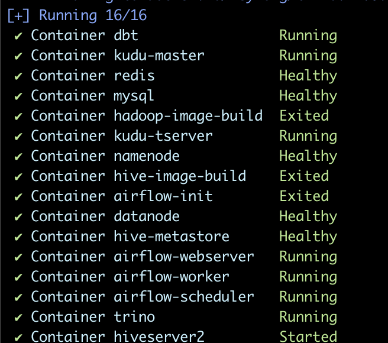
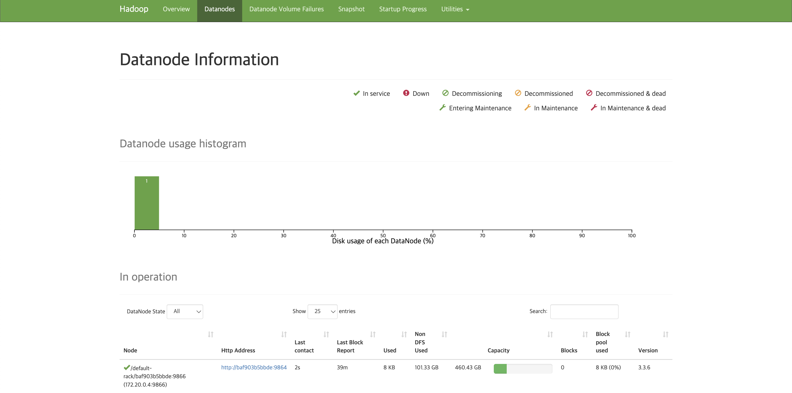
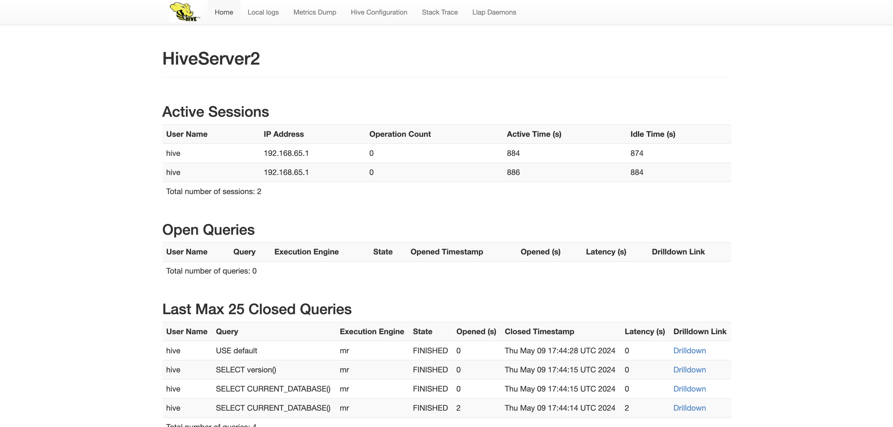
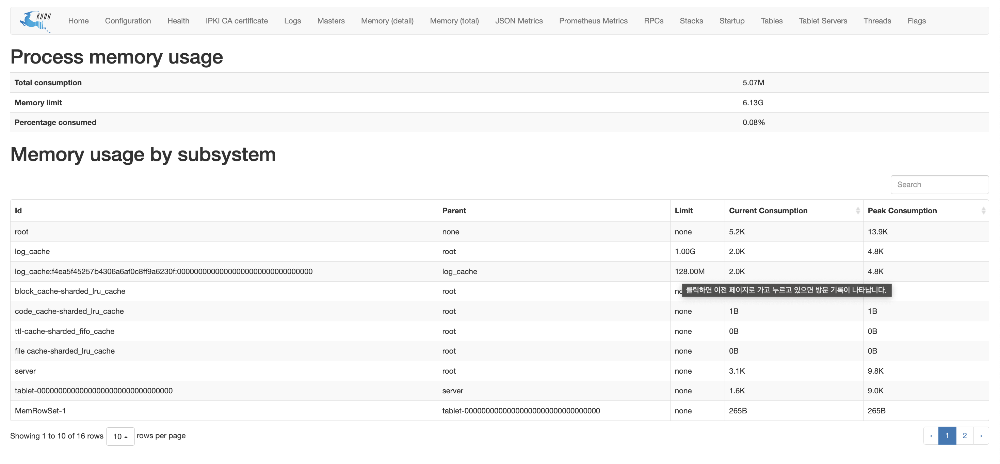
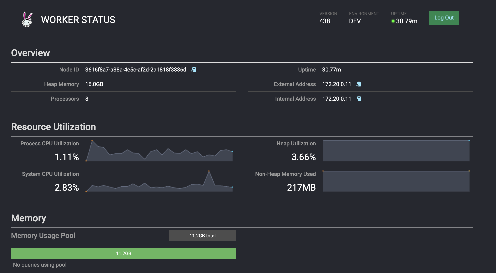
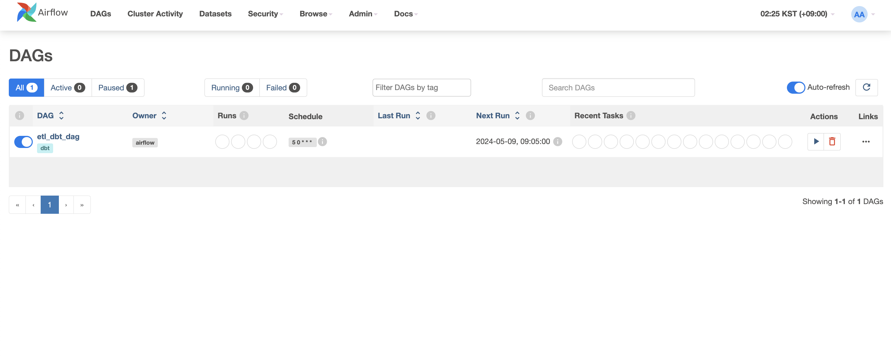
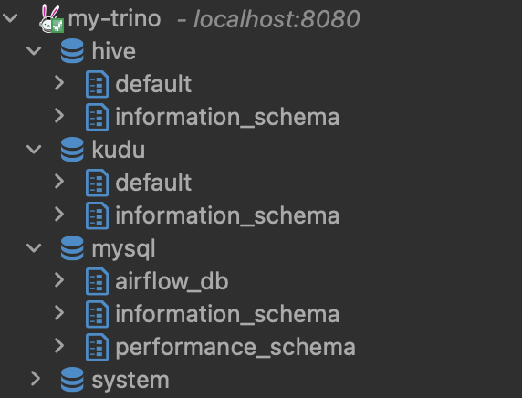
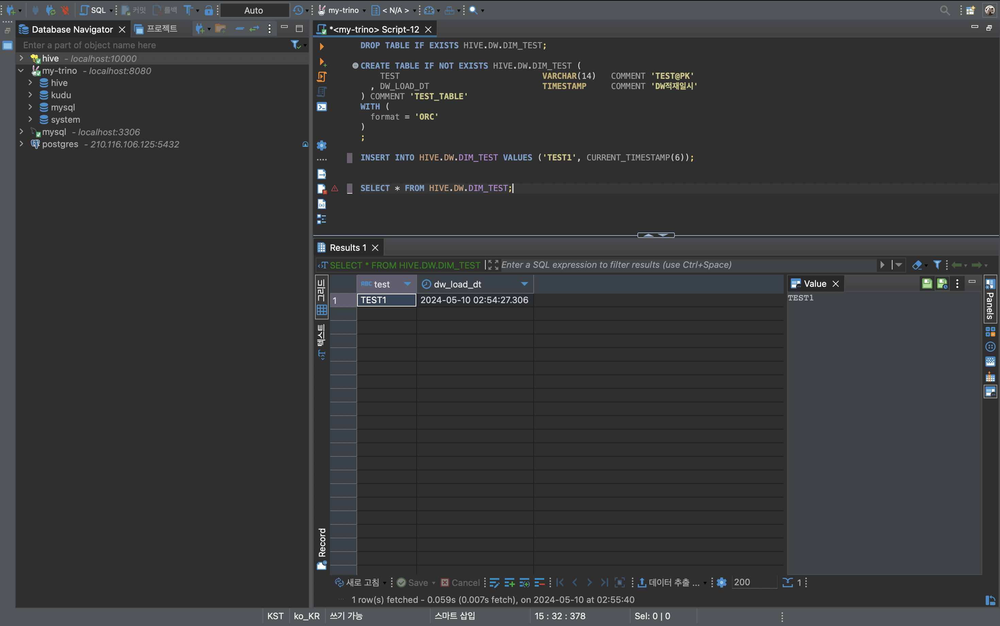
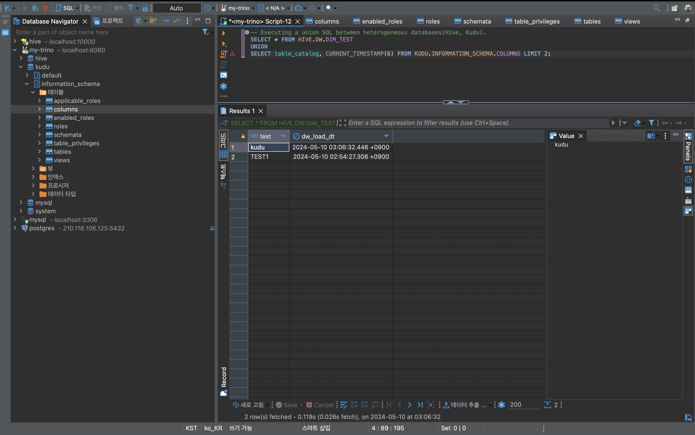

datalake-playground
======================

## Description

여러 스토리지(RDB, HDFS, Columnar Storage), 이기종 간의 쿼리(Trino), 스케줄러(Airflow), ETL/ELT(DBT)를 로컬에서 테스트할 수 있는 DataLake Playground

## Pipeline Component

| Pipeline Component                     | Version | Description                   | Port                            |
|----------------------------------------|---------|-------------------------------|---------------------------------|
| [MySQL](https://www.mysql.com/)        | 8.36+   | Relational Database           | 3306                            |
| [Hadoop](https://hadoop.apache.org/)   | 3.3.6+  | Distributed Storage           | namenode: 9870, datanode: 9864  |
| [Trino](https://trino.io/)             | 438+    | Distributed Query Engine      | 8080                            |
| [Hive](https://hive.apache.org/)       | 3.1.3   | DFS Query Solution            | hiveserver2(thrift): 10002      | 
| [Kudu](https://kudu.apache.org/)       | 2.3+    | Columnar Distributed Database | master: 7051, tserver: 7050     |
| [Airflow](https://airflow.apache.org/) | 2.7+    | Scheduler                     | 8888                            |
| [DBT](https://www.getdbt.com/)         | 1.7.1   | Analytics Framework           | -                               |

## Connection Info

| Pipeline Component                     | User              | Password                      | Database                        |
|----------------------------------------|-------------------|-------------------------------|---------------------------------|
| [MySQL](https://www.mysql.com/)        | root              | root                          | default                         |
| [MySQL](https://www.mysql.com/)        | airflow           | airflow                       | airflow_db                      |
| [Trino](https://trino.io/)             | Allowing all      | -                             | 8080                            |
| [Hive](https://hive.apache.org/)       | hive              | hive                          | default                         | 
| [Airflow](https://airflow.apache.org/) | airflow           | airflow                       | -                               |

** 접속 계정으로 database, schema, table 생성이 가능합니다.

## Execution

ubuntu 이미지 위에 수동 설치하는 아파치 오픈소스는 아파치 미러 서버(CDN)에서 다운받도록 하여, 전반적인 설치 속도를 개선하였습니다. 하지만 사용자의 네트워크 환경에 따라 크게 달라질 수 있어, 네트워크가 원활한 환경에서 설치해주시는 것이 좋습니다.


### MySQL

- mysql의 경우 docker-compse 내 mac silicon 기준(`platform: linux/amd64`)으로 설정되어 있어, window에서 실행시 해당 줄을 주석 처리 해야 합니다.

### Trino

- trino의 Web UI/JDBC 접속(예: DBeaver)에 User는 어떤 문자열이든 접속 가능합니다. 접속 패스워드는 없습니다.

- 다만, dbt-trino 내 `profiles.yml` 내의 `user`와 맞춰주셔야 합니다.

### DBT

- dbt는 airflow 내에서 airflow-dbt와 연계하여 동작합니다. 별도의 로컬에서 사용하시려면 가상환경을 만들어야 합니다. (차후, poetry로 빌드 보완 예정)

### Kudu & Hadoop

- 로컬 환경에서 적은 리소스로 테스트 환경을 구축하기 위해 kudu-tserver와 hadoop-datanode의 `복제계수(replica)`는 1으로 수정하였습니다.

- Kudu는 Storage만 하는 DB로, 쿼리를 실행할 수 있는 별도의 엔진(impala, trino 등)이 필요합니다.

### Hue

- hue가 필요하시면 docker-compose.yml에서 주석을 풀어 사용가능합니다.

### Airflow

- Airflow는 Clery Executor로 구성되어 있습니다. `airflow-trigger`는 리소스 여건으로 주속이 되어 있습니다.  

## Getting Started

```bash
# 1-1. If you want to specify the required profile and bring up containers using the CLI
$ COMPOSE_PROFILES=trino,kudu,hive,dbt,airflow docker-compose -f docker-compose.yml up --build -d --remove-orphans

# 1-2. If you want to bring up all containers at once
$ make up

# 2-1. If you want to stop running containers
$ make down

# 2-2. If you want to remove running containers while deleting Docker images, volumes, and networks resources.
$ make delete.all
```

### Checking if it's running properly

1. `./mnt/schematool-check` 폴더 안에 `initialized` 파일이 생기면 hive-metastore가 초기화가 정상 실행되었습니다.

2. docker compose 실행 시 아래와 같은 이미지가 나오면 성공적으로 컨테이너가 실행되었습니다.



3. 컨테이너 실행 후 특정 플랫폼의 [웹 UI](https://github.com/keyhong/datalake-playground?tab=readme-ov-file#pipeline-component) 접속이 되지 않았다면 다시 빌드를 해야 합니다.

 <hr>
 <hr>
 <hr>
 <hr>
 <hr>

4. DBeaver에서 JDBC 접속(`jdbc:trino://localhost:8080`) 후 3개의 catalog(hive, kudu, mysql)이 보이면 정상입니다.



### Trino Test Code

- Test Code는 `init-sql/trino` 디렉터리에 있습니다.

- `test_code_1.sql`: Hive 카탈로그에 접속해 Schema, Table 생성 및 Data Insert, Select 테스트
  


- `test_code_2.sql`: 이기종 DB(Hive, Kudu) 테이블 간의 Union 연합 쿼리




## Next Challenge

- 클린코드를 위한 파이썬 정적 분석 도구 및 빌드 시스템 보완 (black, ruff, isort, mypy, poetry)
- 정적 분석 자동화를 위한 CI (workflows) 보완 (pre-commit)
- DBT-Airflow 연계 ETL/ELT 시뮬레이션


